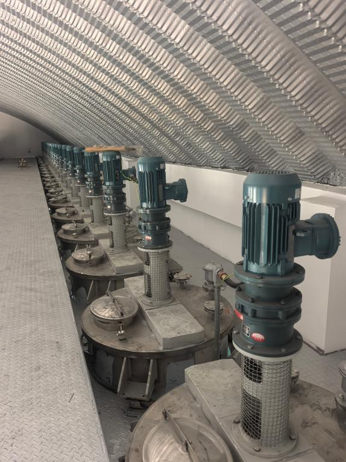
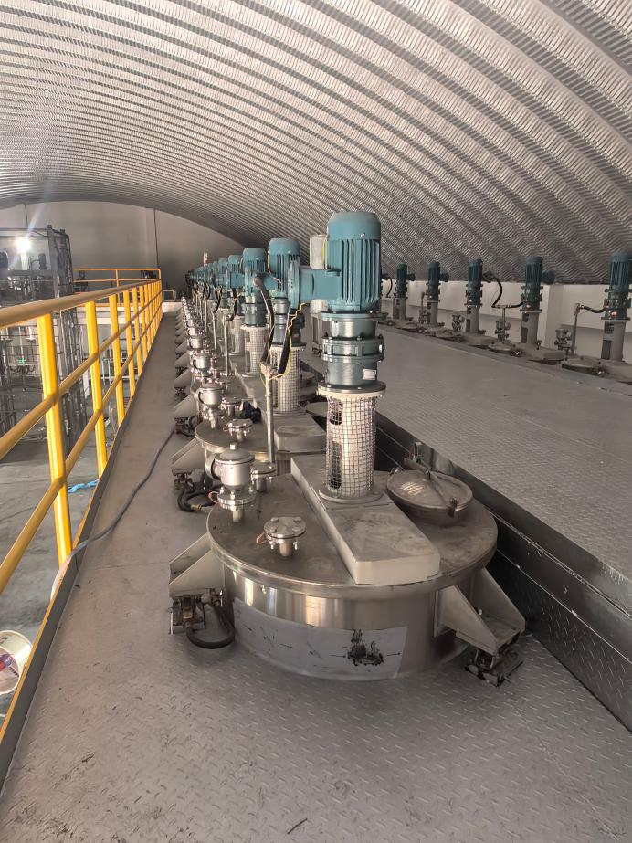

{公司}公司在{行业}行业应用非常广泛，有非常多的应用案例。以下列举一些应用方面的实例。

称重模块安装于地面和罐体支耳之间，3或4个称重模块支撑整个罐体，罐体重量全部加载在称重模块上。

接线盒固定在罐体旁边，将3或4个称重传感器的信号汇总后再传输到称重显示控制器，安装位置根据现场布局合理设定，避免影响投料操作。

称重显示仪表可以独立安装也可以嵌入仪表箱内安装，具体安装方式与自动控制部分相结合而定。

防爆区域可采用隔爆仪表

