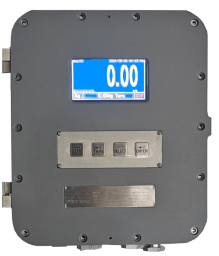

## 产品描述

Demo版本示例说明：COPA是一款面向称重设备销售业务流的辅助软件。

## 特点

模块化设计

100,000显示分度精度

支持数字滤波器与免标定功能

1路RS232及1路RS485，选件板支持PROFINET,ETHERNET/IP,MODBUS-RTU, MODBUS-TCP,ETHERCAT,PROFIBUS-DP，4-20mA（仅限单通道）

工作温度：-10ºC -40ºC，相对湿度：10%-95％，无冷凝

通过串口、PLC选件接口和以太网口远程配置参数、校秤

具有手动/自动修正角差功能

工作电源24V DC

有时间日期功能；

壁挂安装

防护等级IP68

隔爆仪表整体防爆认证：Ex d ia [ia Ga] IIB+H2 T6 Gb；Ex tD iaD [iaD] A21 IP68 T80℃

数字芯片接口，精度和信号传输的稳定性得到大幅提高

1-4通道可选（一只仪表最多可接4台秤）