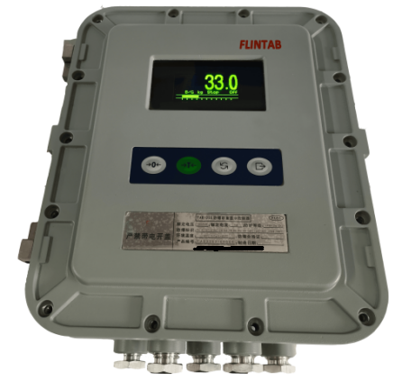

## 产品描述

Demo版本示例说明：COPA是一款面向称重设备销售业务流的辅助软件。

## 特点

最大速率为240次/秒

RS232 或 RS485 输出

OLED液晶显示屏，17mm字高

砝码标定或非砝码标定

自诊断功能

键盘锁定功能

设置预置点

防爆等级：Ex d ia[ia Ga] IIB +H2 T6 Gb/Ex tD iaD[iaD] A21 IP68 T80℃

隔爆型，可用于1、2和21、22区