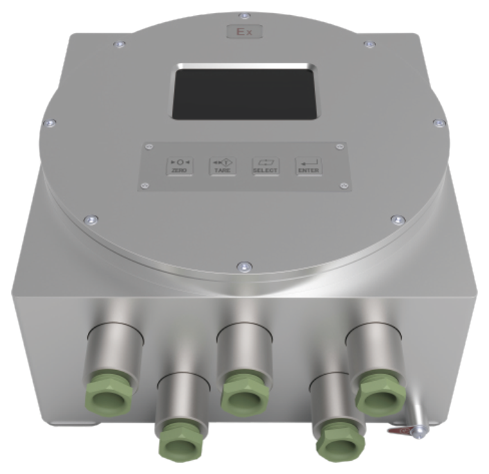

## 产品介绍

Demo版本示例说明：COPA是一款面向称重设备销售业务流的辅助软件。

## 特点

模块化设计

秤台连接，最多支持4个模拟秤台

支持中英文菜单

具备清零，清皮，去皮等按键称重功能

支持数字滤波器与免标定功能

基本型支持隔离2入4出离散IO与1路隔离RS485和隔离RS232

选件板支持：Profinet，Ethernet/IP，Modbus-RTU，Modbus-TCP，EtherCAT，Profibus-DP

支持：4-20mA，0-10V输出

4.3寸TFT高分辨率彩色显示屏幕

防爆等级：Ex d ia[ia Ga] IIC T6 Gb；Ex tD iaD[iaD] A21 IP68 T80℃