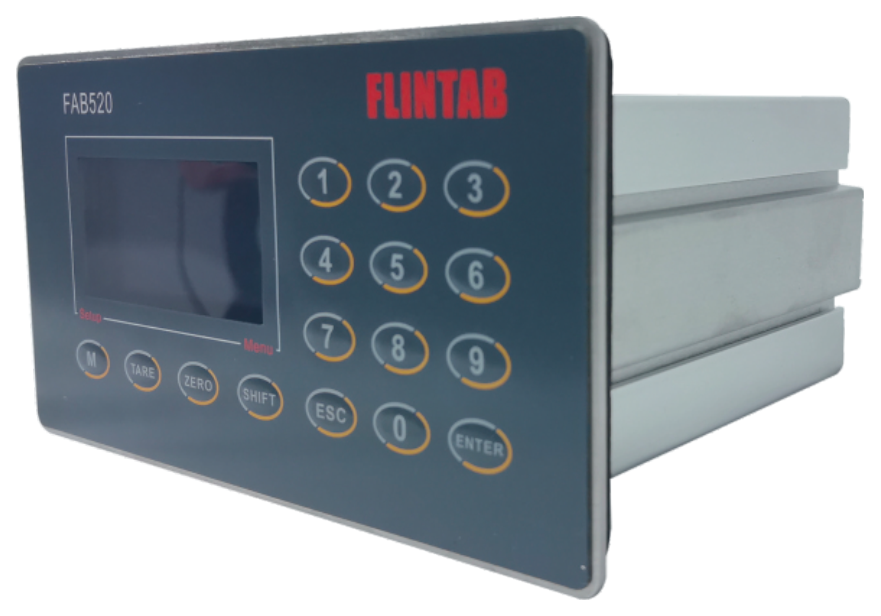

## 产品介绍

Demo版本示例说明：COPA是一款面向称重设备销售业务流的辅助软件。

## 特点

128x64超高亮点阵显示，黄色，中文显示菜单

100,000d高显示精度，6000e CMC计量认证精度

200Hz A/D采样速度，300次/秒定值比较速度

5级动态数字滤波，高抗震动态滤波

具备免砝码数字标定功能

标配1个串口（RS232+RS232/485），并支持MODBUS-RTU

20组物料配方存储

标配2个串口：RS232+RS485

10路输入/12路晶体管输出

10路输入/12路继电器输出

1路4-20mA模拟量输出可选

Profibus-DP接口可选