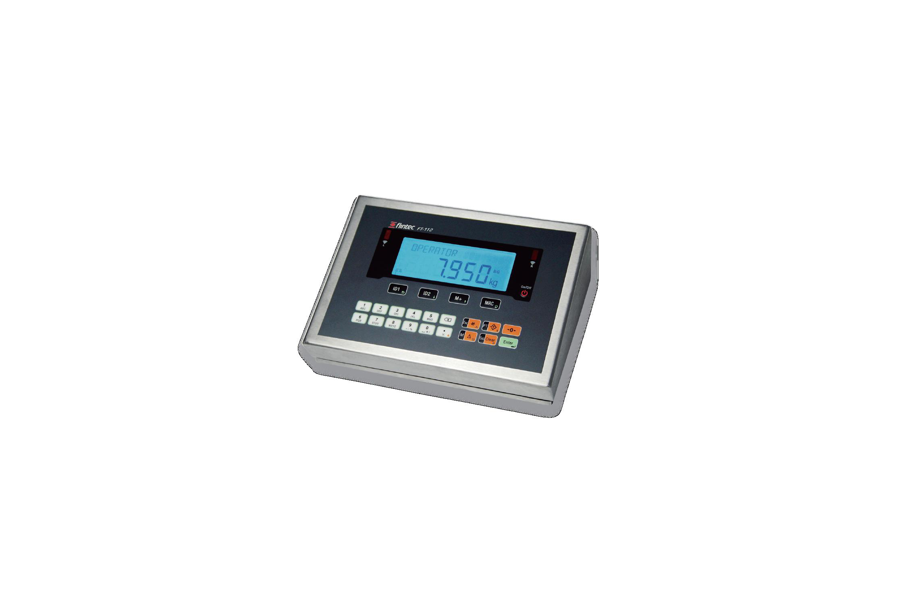

## 产品介绍

FT-111称重仪表是一款多功能仪表，通过数字量的输入输出和各种现场总线通讯，适用于多种应用，其中包括基本称重功能，标签打印功能以及动态系统监测。

FT-111称重仪表操作界面直观，操作简单，有三个外壳版本：盘装、台式和壁挂，订货时需选定安装支架，盘装面板防护等级IP67，台式和壁挂式整机防护等级IP67。

## 特点

EU认证，10,000分度

最多可连接8只350Ω或25只1100Ω传感器

4线制或6线制接线方式均可

5级数字滤波方式

可选RS232C，RS485，USB输出

升级简单

砝码标定和非砝码标定

可选二区防爆Ex2/22

安装方式可选

供电：盘装仪表24VDC；台式仪表24VDC或220VAC