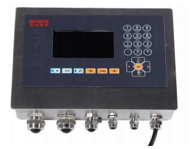

## 产品描述

FT-210是一款功能强大的工业称重控制仪表，精度高、长期稳定性好、接口丰富，满足工业自动化称重控制需求，适应于生产工艺中涉及的计量和控制。

FT-210为4.3英寸800x600的高分辨率彩色显示屏幕,其认证精度为6000e ,显示分度为100000。标配RS232/485通讯接口，支持Modbus RTU通讯。

5级动态数字滤波功能，满足动态称重需求；具有非砝码标定功能，解决大型料仓标定问题。

可选Modbus-TCP,UDP,Profibus DP、Profinet、Ethernet/IP总线，具有灌装功能、检重功能、动物称重功能。

使用Webserver进行远程配置和维护诊断，参数备份和恢复。

FT-210支持数字接线盒、数字传感器。

## 特点

EU认证，6000分度

线性误差小于0.001%

激励电压5VDC,最多可连接8只350欧的传感

传感器六线制接线

砝码标定和非砝码标定

最大转换速率1200次/秒

数字滤波，五级数字滤波