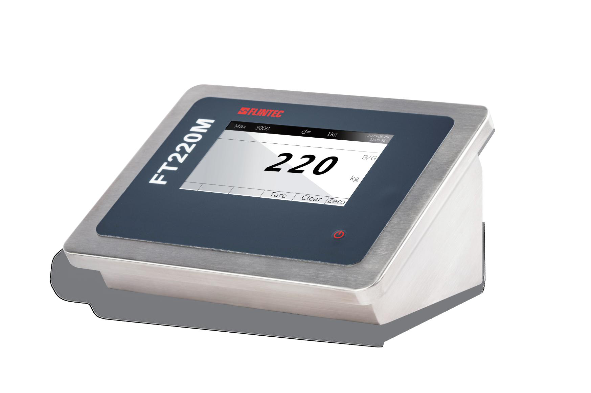

## 产品介绍

FT220M为一款高精度的称重仪表，专为汽车衡设计制造；台式结构，可适合壁挂式安装方式；独特的不锈钢结构，强度高，防护等级IP66，满足各种工况需求。

FT220M满足II级秤的要求，认证分度6,000分度（单量程）或2x3,000分度（双量程），最大显示分度100,000分度。

显示屏为7寸彩屏，1024x600；触摸屏操作，开关机键；支持中英文显示。

FT220M自带内存，可存储10,000笔称重数据，以及200笔预置皮重或者临时皮重；并可按月，按日期，按车号来查询或者打印报表。

FT220M最多可连接16个数字传感器，传感器出错报警，并具有自我诊断功能，串口、显示，按键自我诊断。

FT220M具有三种工作模式：普通称重，二次称重和预置皮重。

## 特点

认证精度6,000e

高精度，显示分度100,000

单量程或双量程

转换速率120次/秒

7寸彩屏，1024x600，支持中文

标配RS232和RS485输出

具有自我诊断功能

IP66