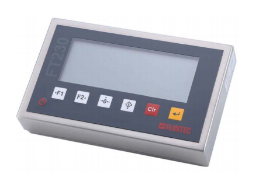

## 产品描述

FT-230为一款经济型，高质量的台秤仪表，不锈钢外壳，防护等级IP66，专为台秤设计开发使用。

FT-230台秤仪表具有基本称重功能、计数功能、简单检重功能和简单动物称重功能。

FT-230台秤仪表是LCD显示，白色显示，60mm字高超大显示器,可以根据环境调整背光亮度，7个按键，带开关电源，支持自动关机和自动休眠。

FT-230台秤仪表可选配电池供电，电池为5200mAh锂电池，最多可以支持40个小时超长续航。

## 产品特点

OIML认证，单量程6,000e和多量程2x3,000e

更新速率80次/秒

LCD显示，60mm字高

不锈钢外壳，防护等级IP66

可选配5200mAh锂电池，续航40小时

标配RS232/485输出

基本称重，计数秤，检重功能，动物称重功能