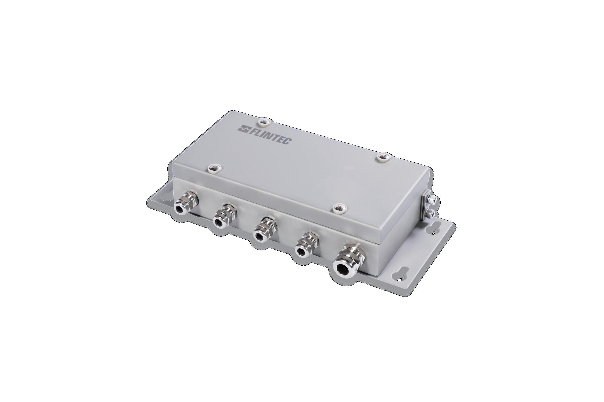

## 产品介绍

KEEX-4接线盒，最多可以连接4只模拟称重传感器，可连接四线制或六线制的传感器，内置高精度可调电位器，角差调整方便，可选防爆软管接头。

KEEX-4接线盒为304不锈钢折弯焊接成型，电缆锁紧头为不锈钢材质。

## 特点

高精度电位器，便于角差调整。

防护等级IP68

KEEX-4防爆等级：Ex ib IIC T4 Gb / Ex ib IIIC T130℃ Db

规格如有变更，恕不另行通知。
