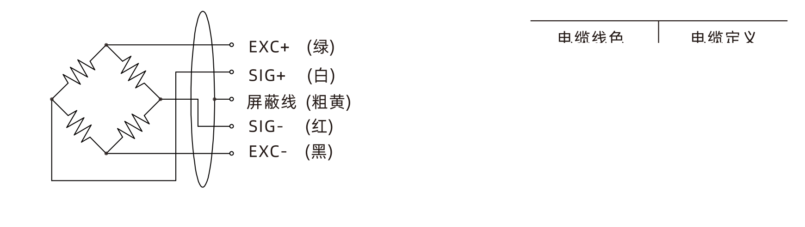

## 产品介绍

AWBS不锈钢型称重传感器一端固定、一端加载、传力形式多样，具有良好的密封结构。焊接密封，受力后自动复位，安装容易、使用方便、互换性好，可用于制作各种电子平台秤、料斗秤、单轨衡、吊秤、皮带秤等。

## 技术指标

（参数表：params_01.csv）

＜3000kg，线长4m；3000、4500、5000kg，线长5m

## 电气连接

接线定义：绿色电源正EXC+、黑色电源负EXC-、白色信号正SIG+、红色信号负SIG-、粗黄屏蔽线

规格如有变更，恕不另行通知。
