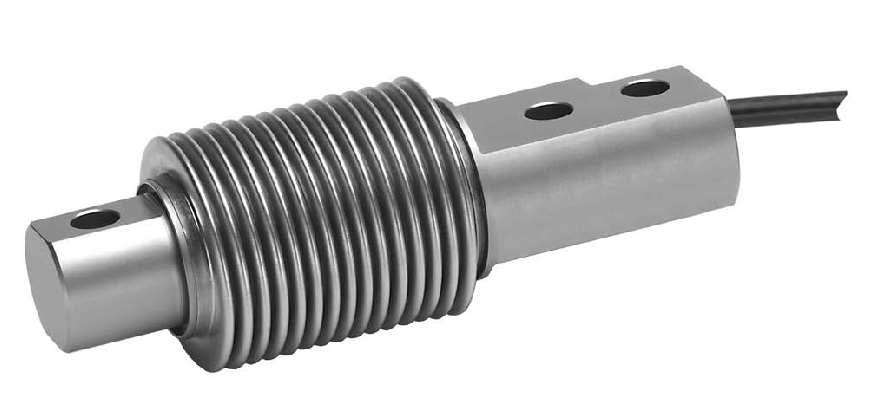
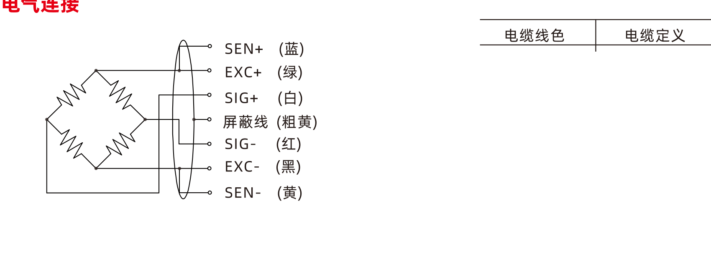

## 产品介绍

AWC传感器为波纹管传感器，不锈钢材质，焊接密封。它适应于各种工业环境。

## 应用

平台秤，台秤，皮带秤，小料斗秤和料仓称重系统，包装秤等。

## 特点

量程10kg到500kg

不锈钢材质

防护等级IP68，焊接密封

支持免砝码标定

## 认证

防爆认证，可应用区域0，1，2和20，21，22

## 技术指标

（参数表：params_01.csv）

*力矩值为假设在涂油的情况下。

## 电气连接

接线定义：绿色电源正EXC+、黑色电源负EXC-、蓝色反馈正SEN+、黄色反馈负SEN-、白色信号正SIG+、红色信号负SIG-、粗黄屏蔽线

规格如有变更，恕不另行通知。
