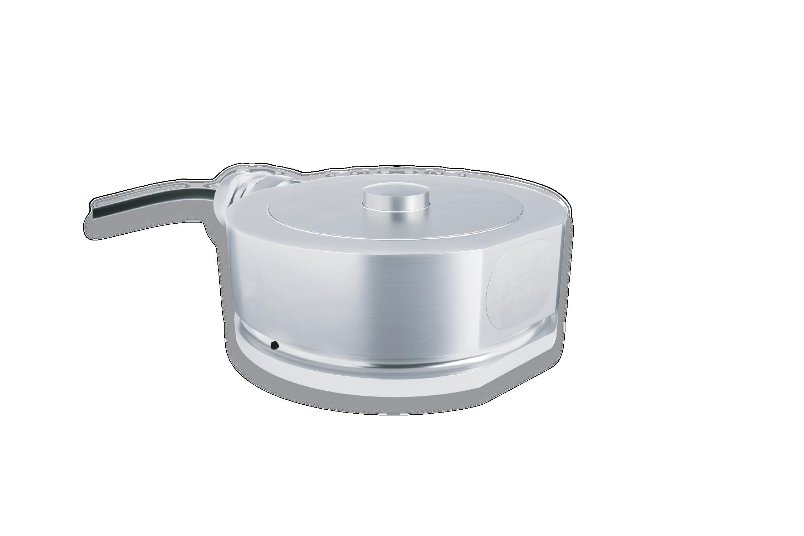

## 产品介绍

CN3是一款反转环式（bending ring）压式称重传感器。高精度，量程广，不锈钢材质，全焊接密封，防护等级可达到IP68。

CN3符合OIML和NTEP要求，可用于贸易结算的各种应用，例如计量罐、料斗和大量程平台秤等称重应用。

CN3用户可以自己设计安装附件，以确保最佳性能。另外，称重传感器无附件也可以直接使用。

## 应用

计量罐、料斗和大量程平台秤等称重应用

自动化和过程控制

## 特点

量程：0.5t—50t

不锈钢材质

防护等级IP68/IP69K

超低结构设计

电抛光表面，可用于洁净场所
