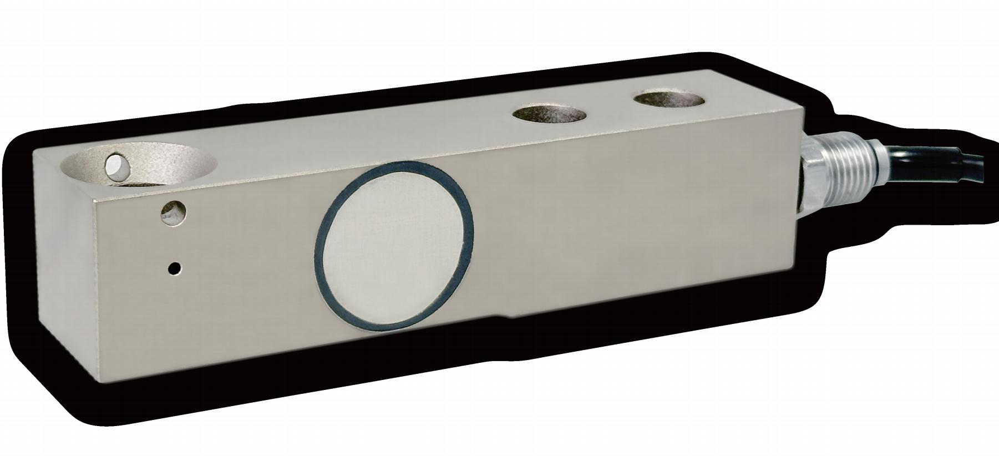

## 产品介绍

FC312悬臂梁式称重传感器，优质合金钢材质，胶封，盲孔安装方式，传感器表面镀镍，可应用于各种复杂的工业环境中。

## 应用

化工，食品，饮料，医药，锂电等行业的称重配料及过程称重控制。

## 特点

量程：250kg—10000kg

综合精度高，最高可达C6

合金钢材质，胶封

防护等级IP67

盲孔安装方式，配套52-30、52-16系列称重模块

出厂前mV/V/Ω补偿分组，非砝码标定精度可达0.05%
