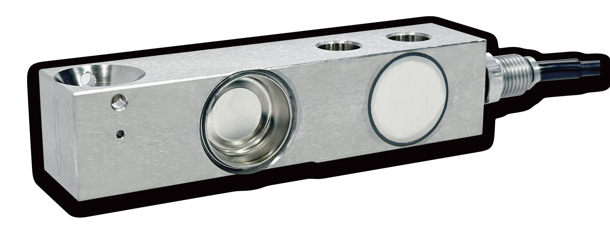

## 产品介绍

FC322悬臂梁式称重传感器，不锈钢材质，采用全金属焊接密封方式，高精度，盲孔安装方式，可应用于各种复杂的工业环境中。

## 应用

平台秤，料斗秤，储罐秤和过程称重。

## 特点

量程：250kg—10000kg

综合精度高，最高可达C6

不锈钢材质

全金属焊接密封，防护等级IP68

盲孔安装方式，配套52-30、52-16系列称重模块

出厂前mV/V/Ω补偿分组，非砝码标定精度可达0.05%
