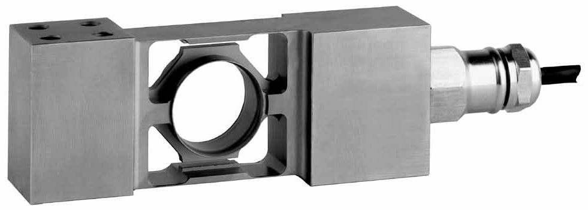

## 产品描述

PC6单点式传感器，不锈钢材质，全金属焊接密封。经典的环型应变区和抗偏载平行梁结构设计，精度高，动态响应好。Y=25000，z=6000，适用于高精度商用秤和大皮重小称量专用称重机械。

应用

高精度商用台秤 、多头秤、高速检重秤

动态皮带秤、分拣秤、包装秤和工业过程称重控制

## 特点

量程10kg到200kg

不锈钢材质

全金属焊接密封，防护等级IP68

高阻抗，适用信号远距离传输和防爆场合

可直接安装，无需垫块
