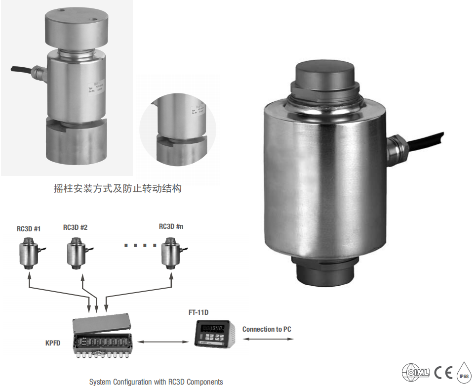

## 产品描述

基于最新芯片技术的RC3D数字传感器，弹性体内置温度和倾斜传感器，通过内置微处理器对实时测量的温度和倾斜度的数据处理，优化传感器的使用精度和测量稳定性，每只传感器与控制器独立通讯，实时诊断，自动纠错，异常数据报警，防作弊。

使用RC3D组件进行系统配置（RC3D数字传感器 + FT-111D称重仪表 / KPFD防爆接线盒，连接到PC端）。

应用

汽车衡，轨道衡，料斗秤，筒仓秤等

## 特点

量程30t，40t和50t

不锈钢材质

全金属焊接密封,防护等级IP68

摇柱结构，良好的自复位性，独特有效的防转结构

专用CPU和A/D转换器

RS485通讯方式，定制通讯协议，高冗余，高纠错率

汽车衡快速自动角差调整，传感器出错提醒

传感器数据加密

内置防浪涌保护器
