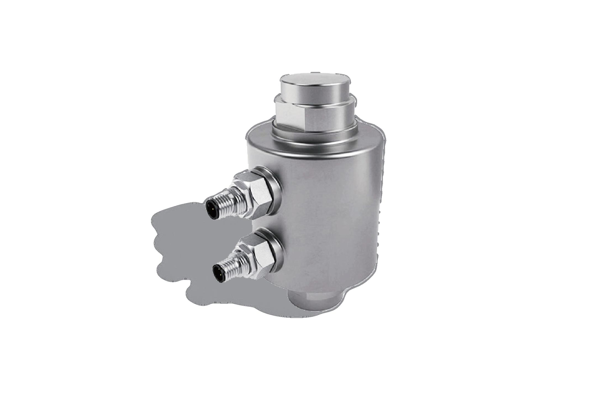

## 产品描述

基于最新芯片技术的RC3DV2数字传感器，弹性体内置温度和倾斜传感器，通过内置微处理器对实时测量的温度和倾斜度的数据处理，对传感器的输出特性进行补偿，保证传感器在恶劣工矿的使用精度和测量稳定性。每只传感器与控制器独立通讯，自诊断功能。最先进数字方案，采用无接线盒数字方案。

称重系统连接：RC3D#1、RC3D#2……RC3D#n 经 M12 接头 / 终端电阻连接 FT-220 仪表及 PC。

## 应用

汽车衡，轨道衡，料斗，筒仓和料仓秤

## 特点

量程：30t，40t和50t

弹性体及壳体均为不锈钢材质

全金属焊接密封，防护等级IP68

摇柱结构，良好的自复位性，独特有效的防转结构

预冲氮气，保护内部器件

专用CPU和A/D转换器

成熟的RS485通讯方式，定制通讯协议，高冗余，高纠错率

汽车衡快速自动角差调整，传感器出错提醒

双航空接头，无接线盒

传感器数据加密

内置防浪涌保护器

防护等级IP69K
