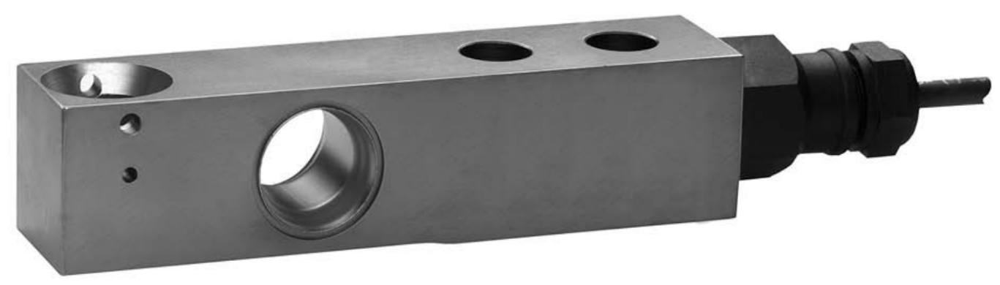

## 产品描述

SB14悬臂梁式传感器，17-4PH不锈钢材质，焊接密封，精度高，标准C3精度等级的Y值11500或23000，C6精度等级的Y值23000

## 特点

量程500lb 到10000Ib（227kg到4536kg）

17-4PH不锈钢材质

全金属焊接密封，防护等级IP68/IP69K

盲孔安装方式，自复位连接件设计

高阻抗，适用远距离传输和防爆场合

出厂前角差补偿，非砝码标定精度可达0.05%

OIML 认证 C3/C6

具有可拆卸更换功能、防过载保护功能、防倾覆功能
