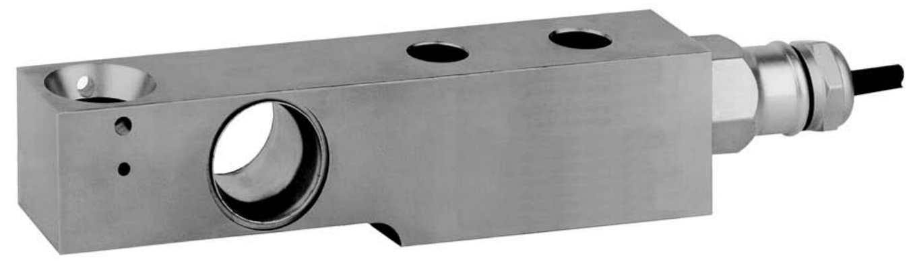

## 产品描述

SB4悬臂式称重梁传感器，不锈钢材质，全金属焊接密封，经典环型应变区设计，精度高，Y=11000，Z=7500，适用于高精度商用秤和工业称重控制领域大皮重小称量需求。

应用

商用衡器：平台秤等

过程控制：筒仓和料仓称重等

## 特点

量程5kN到100kN（510kg到10197kg）

不锈钢材质

全金属焊接密封，防护等级IP68

盲孔安装方式，配套52-30、52-16系列称重模块

高阻抗，适用远距离传输和防爆场合

出厂前角差补偿，非砝码标定精度可达0.05%
