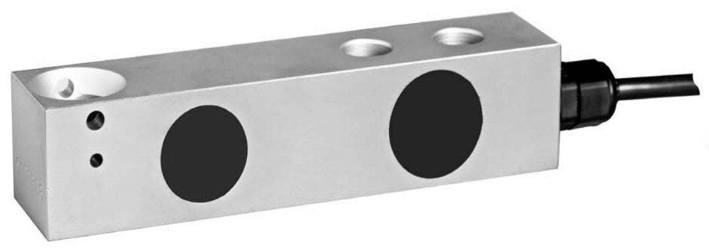

## 产品描述

SLB悬臂梁式传感器，不锈钢材质，胶封，独特环型应变区设计， 精度高，Y=11500，适用于商用台秤和使用环境要求不高的工业称重控制领域。

应用

平台秤，称重料仓和料斗。

## 特点

量程91kg到3000kg

不锈钢材质

防护等级IP67

盲孔安装方式，配套52-30、52-16系列称重模块

高阻抗，适用远距离传输和防爆场合

出厂前角差补偿，非砝码标定精度可达0.05%
