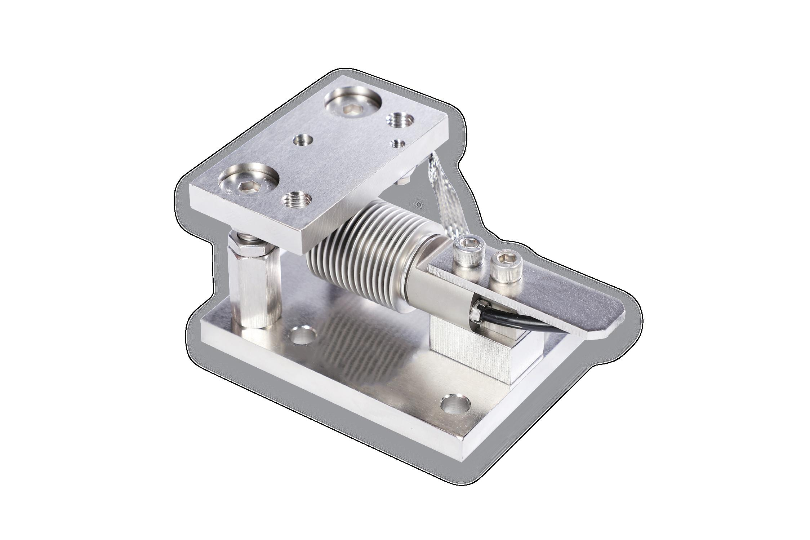

## 产品介绍

52-20称重模块压头采用球形设计，确保传感器受力始终处于垂直方向，避免侧向力对测量的影响，保证测量精度。

52-20防护等级IP68，可选全不锈钢结构，适合恶劣的环境。

52-20称重模块，安装简单，维护方便。

52-20带两个支撑螺栓，具有防倾覆功能。

适应SB8，SB6传感器。

材质：碳钢镀镍、不锈钢。

适应于化工、医药、食品、包装等行业的料罐称重，以及工业自动化控制的配料等应用。

## 特点

量程10kg—500kg

通用性强

超低结构

安装方便

防止倾覆

球形压头

W&M认证
