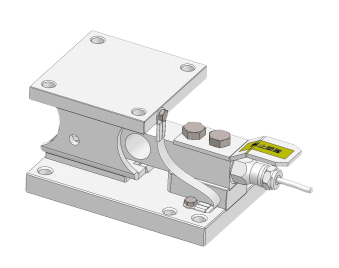

## 产品介绍

自恢复性称重模块，精度高，可靠性好

量程：91kg—5099kg

适用SLB、SB14、SB5传感器

适合动、静载两种称重应用

## 特点

防过载保护功能

防倾覆功能

传感器可拆卸，替换方便

整体安装高度低

2只水平拉杆稳定设备的晃动（选配）

电缆接头保护板（防踩踏板），防止意外损伤传感器接头

易安装

高强度

盲孔安装

完整的防跳设计

完整的防脱保护设计

材质：合金钢（镀镍）、不锈钢
