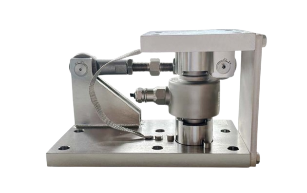

通用型静(动)载称重模块，自复位传力方式，带防扭转拉杆，配置运输和检修维护防过载螺母，整体性好

量程：7.5t—100t（7.5/15/22.5/30/40/50/100t）

适用RC3系列传感器

摇柱（传感器摇柱）传力方式，防转动结构

适合动、静载两种称重应用

防过载保护功能

传感器可拆卸，替换方便

整体安装高度低

防扭转拉杆稳定设备的晃动

完整的防跳设计

完整的防脱保护设计

材质：碳钢镀镍、不锈钢

认证：W&M认证、RoHS
