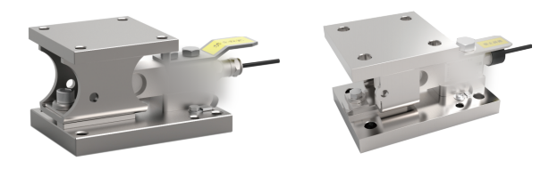

## 产品介绍

M30称重模块强大的功能使其能够轻松满足工业生产中的各种动载及静载称量需求。

强大的结构件为设备提供全方位保护。

自复位传感器在动态称量时产生回复力，它使秤台自动回至稳定位置，从而使称量变得精确可靠。

量程：200kg—5000kg

适用AWB/AWBS系列传感器

材质：C-合金钢/S-304不锈钢

## 特点

U型结构

支持现场无传感器安装，保护传感器

防倾覆保护

防过载保护

传感器可更换功能

水平限位保护

水平拉杆稳定设备的晃动（选配）

整体安装高度低

适合动、静两种称重应用，动静载一体化设计

自复位功能，计量性能精准可靠

电缆接头保护板，防止意外损伤传感器接头

配传感器跨接地线，地线为纯铜镀锡
