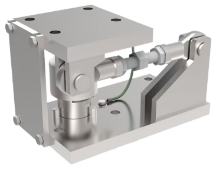

产品介绍

M50通用型静(动)载称重模块，自复位传力方式带防扭转拉杆，配置运输安装保护板

整体性好。

传感器柱式传力方式，称重装置的复位性好和整机精度高、长期稳定性好。

量程5t到100t（5/7.5/10/15/20/22.5/30/40/50/100t）

适用AWD系列传感器

材质：C-合金钢/S-304不锈钢

## 特点

柱式安装方式，复位性好

量程5t到100t

整体安装高度低

安装维护方便

防脱保护

过载保护

选配：上、下安装过渡板（图示符号区分带有限位装置/不带装置）
