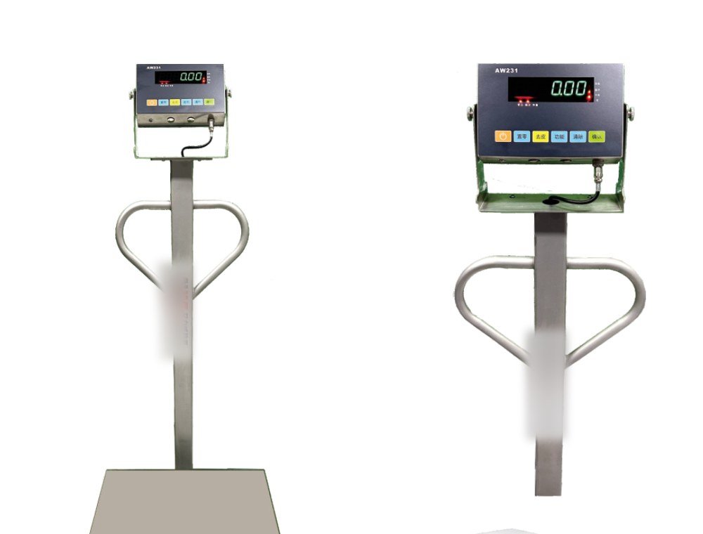

## 产品介绍

AWBY系列移动式电子台秤是一款多功能实用型的经济型台秤，集多种功能于一体（Over/Under检重，分选以及简单计数功能），可充分满足您的各种使用要求。

AWBY系列移动式电子台秤通过RS232串口可实现台秤与打印机或PC之间的通讯，锂电可充电电池供电，容量大，续航时间长。

AWBY系列移动式电子秤可选防爆，防爆等级Ex ib IIC T4 Gb。

## 特点

量程30-600kg

4种秤体规格

快速显示重量

经济实用型台秤

OIML认证

材质：C-碳钢或S-不锈钢

可选防爆Ex ib IIC T4 Gb

WIFI，蓝牙功能
