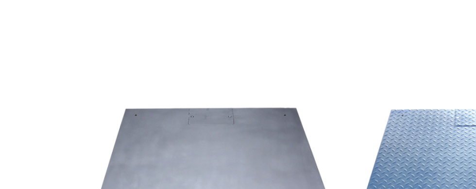

## 产品介绍

AWPE系列电子平台秤采用全新结构秤台，秤台结构由秤体和框架组成，由四只高精度剪切梁式称重传感器和智能化称重显示仪表组成，准确度高，称量迅速，工作稳定可靠，安装维护简单方便。

AWPE系列电子秤可选防爆型，防爆等级Ex ib IIC T4 Gb。

## 特点

碳钢（花纹板）或不锈钢（光面或喷砂处理）

低秤台结构设计

秤台由秤体和框架组成

不倒翁式自动复位机构

材质：C-碳钢或S-不锈钢

可选防爆Ex ib IIC T4 Gb
