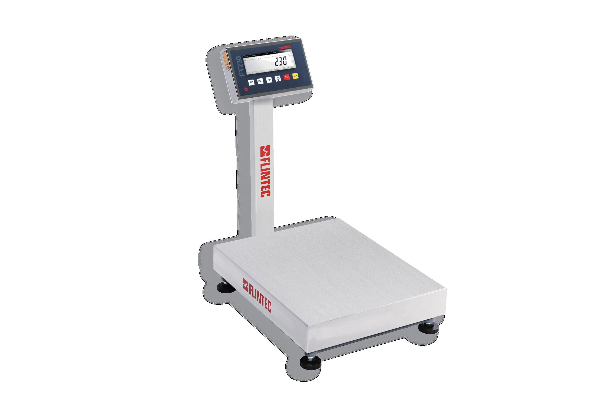

## 产品介绍

FTBR系列电子台秤是一款多功能实用型的经济型台秤，集多种功能于一体（Over/Under检重，分选以及简单计数功能），可充分满足您的各种使用要求。

FTBR系列电子台秤通过RS232串口可实现台秤与打印机或PC之间的通讯，铅酸电池供电，容量大，使用时间长久。FTBR系列电子秤可选防爆，防爆等级ExdIIBT4Gb / ExiaD21T130℃ DA21 IP65。

FTBR系列台秤由单点式传感器和秤体组成，碳钢秤体配置铝传感器或合金钢传感器，不锈钢秤体配置不锈钢传感器，可为秤长期稳定性提供可靠保证。有两种规格：碳钢秤体不锈钢台面台秤和全不锈钢台秤。

## 特点

量程：3—600kg

高清晰快速显示重量

经济实用型台秤

OIML认证，3000e

秤台：碳钢或者不锈钢

可选防爆

加强秤体结构，2mm秤罩标配，让秤体更加稳定，精度更高
