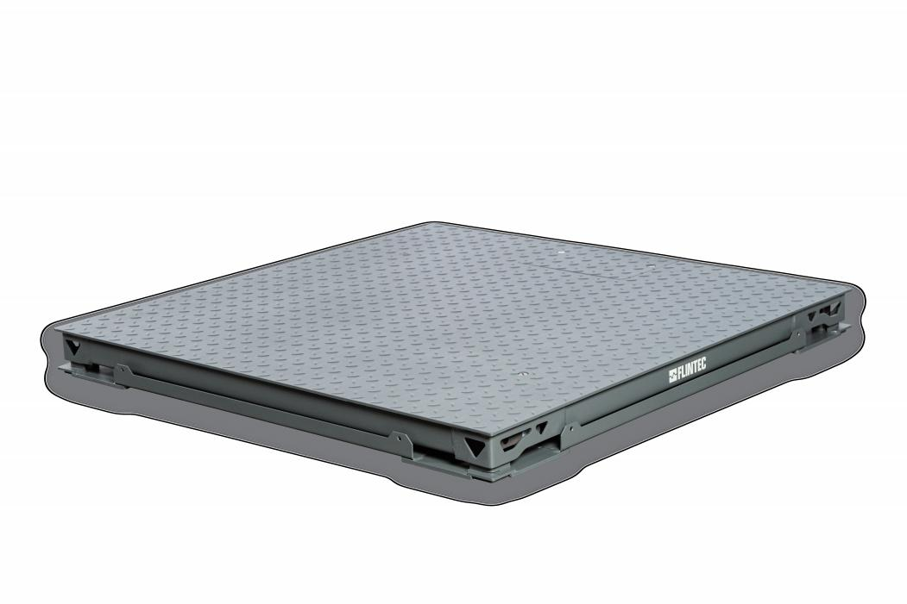

## 产品介绍

FTPD系列电子平台秤采用全新结构秤台，秤台结构由秤体和框架组成，配用四只高精度紧密型单剪切梁式称重传感器和智能化称重显示仪表组成的电子秤，该系统准确度高，称量迅速，工作稳定可靠，安装维护简单方便。

FLINTEC的FTPD系列平台秤包含了4个高精度、高阻抗、高Y值的传感器，以及1个高精度接线盒，可为平台秤的高精度提供可靠保证。有三种规格：碳钢秤体，不锈钢秤体，碳钢秤体不锈钢面板；可以无基坑或浅基坑安装。

## 特点

碳钢花纹钢板或不锈钢喷砂

低秤台结构设计

秤台由秤体和框架组成

圆柱头摇摆式自动复位机构

限位一次成型，无需调整

可选防爆ExdibIBT4

加强的底框结构设计，让秤体更稳定，精度更高；同时可以采用可拆卸边框设计，传感器维护更加简单、便捷
